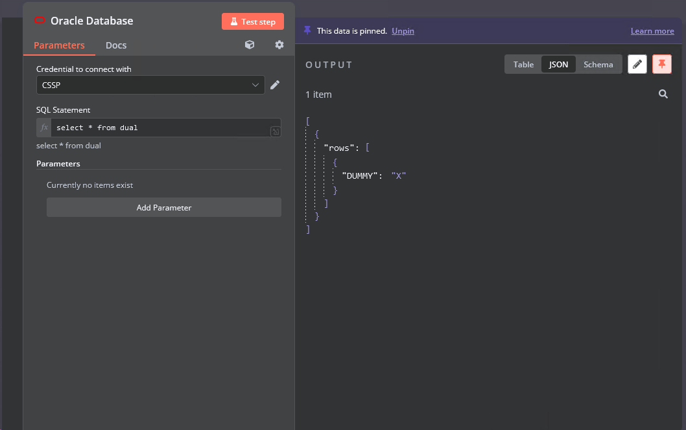
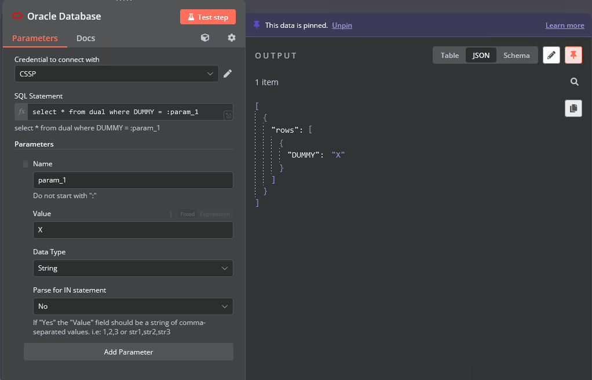
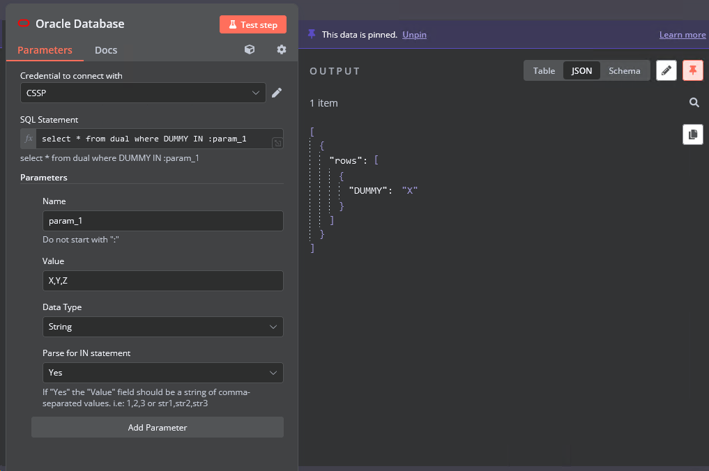

# n8n-nodes-oracle-database-thin

[](https://www.npmjs.com/package/@jonales/n8n-nodes-oracle-database-thin)
[](https://www.npmjs.com/package/@jonales/n8n-nodes-oracle-database-thin)


[Oracle Database](https://docs.oracle.com/en/database/oracle/oracle-database/) node para **n8n**, com **suporte integrado ao cliente fino (thin mode)** e **parametrização avançada de consultas SQL**.

> **🎉 Versão 1.2.0 - Atualização Importante**  
> Este pacote **não requer mais** instalação manual do **Oracle Instant Client** ou Oracle CLI.  
> Todo o cliente necessário está embutido através do thin mode do `oracledb` 6.x, funcionando de forma transparente em **Windows, Linux, macOS, Docker e ambientes serverless**, sem configuração adicional.

---

## 📋 Sobre este projeto

Forked de [n8n-nodes-oracle-database](https://www.npmjs.com/package/n8n-nodes-oracle-database) com o objetivo de adicionar funcionalidade de parametrização e eliminar dependências externas do Oracle.

---

## ✨ Principais características

- **🔧 Zero configuração** — Sem Oracle Instant Client ou variáveis de ambiente
- **🔒 Segurança aprimorada** — Suporte completo a bind variables (`:nome_parametro`)
- **📊 Operador IN inteligente** — Processamento automático de listas para consultas `IN`
- **🌐 Compatibilidade universal** — Funciona em qualquer ambiente Node.js
- **⚡ Performance otimizada** — Thin mode nativo para conexões eficientes

---

## 📌 O que mudou na versão 1.2.0

- ✅ **Thin mode exclusivo** — Removido `initOracleClient` e dependências externas
- ✅ **Credenciais simplificadas** — Apenas *user*, *password* e *connectionString*
- ✅ **Parametrização robusta** — Bind variables seguras no formato `:nome_parametro`
- ✅ **Suporte aprimorado para `IN`** — Conversão automática de listas
- ✅ **Compatibilidade estendida** — Oracle Database **12.1+**, Autonomous Database

---

## 🚀 Instalação

```
npm install n8n-nodes-oracle-database-thin
```

> 💡 **Não é necessário** instalar Oracle Instant Client, configurar `LD_LIBRARY_PATH` ou qualquer dependência externa.

---

## ⚙️ Configuração no n8n

### 1. Configurar credenciais Oracle

No n8n, adicione credenciais do tipo **Oracle Credentials**:

| Campo | Descrição | Exemplo |
|-------|-----------|---------|
| **User** | Usuário do banco de dados | `system` ou `hr` |
| **Password** | Senha do usuário | `sua_senha_aqui` |
| **Connection String** | String de conexão no formato `host:port/service_name` | `localhost:1521/XEPDB1` |

#### Exemplos de Connection String:
```
# Banco local
localhost:1521/XEPDB1

# Servidor remoto
oracle.empresa.com:1521/PROD

# Oracle Cloud (Autonomous Database)
adb.sa-saopaulo-1.oraclecloud.com:1522/g4c12345_dbname_high.adb.oraclecloud.com
```

### 2. Usar o node no workflow

Adicione o node **Oracle Database with thin** ao seu workflow e configure a consulta SQL com parâmetros.

---

## 💡 Exemplos de uso

### Consulta simples sem parâmetros

```
SELECT id, name, email 
FROM users 
ORDER BY id
```

### Consulta com parâmetros

```
SELECT id, name, email 
FROM users 
WHERE department_id = :dept_id 
  AND created_date > :start_date
```

**Configuração dos parâmetros:**
- `dept_id` (Number): `10`
- `start_date` (String): `2024-01-01`

### Consulta com operador IN

```
SELECT id, name, category 
FROM products 
WHERE category_id IN (:categories)
  AND price < :max_price
```

**Configuração dos parâmetros:**
- `categories` (String, Parse for IN: Yes): `1,2,3,5`
- `max_price` (Number): `100.00`

O node converte automaticamente para:
```
WHERE category_id IN (:categories_abc123, :categories_def456, :categories_ghi789, :categories_jkl012)
```

---

## 📷 Exemplos visuais

### Consulta normal


### Nova funcionalidade - Parâmetros


### Exemplo com operador IN


---

## 🔧 Desenvolvimento e testes

### Testar localmente antes de publicar

```
# No diretório do pacote
npm install
npm run build
npm link

# No diretório do seu projeto n8n
npm link n8n-nodes-oracle-database-thin

# Iniciar n8n e testar
# ...

# Quando terminar os testes
npm unlink n8n-nodes-oracle-database-thin
```

### Build do projeto

```
npm run build        # Compilar TypeScript + copiar ícones
npm run dev          # Modo watch para desenvolvimento
npm run lint         # Verificar código
npm run format       # Formatar código
```

---

## 🗃️ Compatibilidade

### Versões suportadas do Oracle Database
- ✅ Oracle Database **12.1** ou superior
- ✅ Oracle Database **18c, 19c, 21c, 23c**
- ✅ **Oracle Autonomous Database** (OCI)
- ✅ **Oracle Express Edition (XE)**

### Ambientes suportados
- ✅ **Windows** (10, 11, Server)
- ✅ **Linux** (Ubuntu, CentOS, RHEL, Alpine)
- ✅ **macOS** (Intel e Apple Silicon)
- ✅ **Docker containers**
- ✅ **Kubernetes**
- ✅ **Serverless** (AWS Lambda, Azure Functions)

### Versões do Node.js
- ✅ Node.js **14.x** ou superior
- ✅ Node.js **16.x, 18.x, 20.x** (recomendado)

---

## 🔐 Segurança

Este node utiliza **bind variables** para todas as consultas parametrizadas, protegendo contra:
- **SQL Injection**
- **Exposição de dados sensíveis** em logs
- **Problemas de encoding** de caracteres especiais

---

## 🆘 Solução de problemas

### Erro de conexão
```
ORA-12541: TNS:no listener
```
**Solução:** Verifique se o serviço Oracle está rodando e a connection string está correta.

### Erro de credenciais
```
ORA-01017: invalid username/password
```
**Solução:** Confirme as credenciais e se o usuário tem permissões necessárias.

### Erro de serviço
```
ORA-12514: TNS:listener does not currently know of service
```
**Solução:** Verifique o nome do serviço na connection string.

---

## 📦 Dependências

- **oracledb** ^6.3.0 (cliente thin embutido)
- **n8n-workflow** ^0.107.0
- **n8n-core** ^0.125.0

---

## 🤝 Contribuição

Contribuições são bem-vindas! Por favor:

1. Faça fork do repositório
2. Crie uma branch para sua feature (`git checkout -b feature/nova-feature`)
3. Commit suas mudanças (`git commit -am 'Adiciona nova feature'`)
4. Push para a branch (`git push origin feature/nova-feature`)
5. Abra um Pull Request

---

## 📄 Licença

[MIT](LICENSE)

---

## 👨‍💻 Autor

**Jônatas Meireles**  
📧 jonatas.mei@outlook.com  
🔗 [GitHub Repository](https://github.com/jonales/n8n-nodes-oracle-database-thin)

---


### **💰 Apoie o projeto**

Se este projeto te ajudou, considere fazer uma contribuição via **PIX** para apoiar seu desenvolvimento contínuo:


🔑 Chave PIX: jonatas.mei@outlook.com

### Chave PIX


👨💻 Desenvolvedor: Jônatas Meireles Sousa Vieira


## 📚 Links úteis

- [Oracle Database Documentation](https://docs.oracle.com/en/database/oracle/oracle-database/)
- [n8n Community Nodes](https://docs.n8n.io/integrations/community-nodes/)
- [Oracle node-oracledb Documentation](https://node-oracledb.readthedocs.io/)
